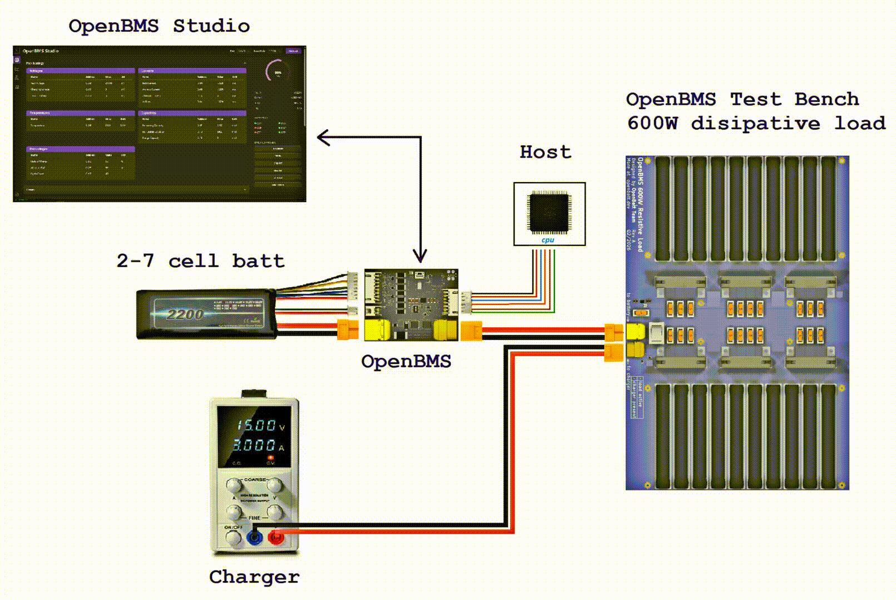

# 🔋 OpenBatt

OpenBatt builds open-source rechargeable battery system projects — hardware, firmware, and docs, all free.

Manage your rechargeable battery properly so you can safely use it in your quadcopter, electric skateboard, solar charger, DIY, and any other project. We provide the tools and knowledge to do it right:

- **Li-ion/Li-Po battery** — your custom 2- to 7-cell battery
- **OpenBMS** — battery management system that handles fuel gauging, cell balancing, learning algorithms, overcharge/overdischarge/overheat protection, and communication with chargers and microcontrollers
- **Test Bench** — a 600W dissipative resistive load for easier BMS development and testing
- **Host** — I2C/CAN interfaces, wake-up signal, can be a microcontroller, computer, etc.
- **Charger** — your custom charger, usually a CC/CV charger adjusted to your battery voltage and current
- **OpenBMS Studio** — a PC software for configuring and monitoring the BMS, visualizing data, and updating firmware using UART communication

## OpenBatt ecosystem in action



## Related repositories

- [OpenBMS-hardware](https://github.com/open-batt/openbms-hardware)
- [OpenBMS-test-bench](https://github.com/open-batt/openbms-test-bench-hardware)
- [OpenBMS-firmware](https://github.com/open-batt/openbms-firmware)
- [OpenBMS-studio](https://github.com/open-batt/openbms-studio)

## Status: 🛠️ Work in progress

| Module | Status |
|--------|--------|
| OpenBMS Schematics & PCB Layout | ✅ Done |
| OpenBMS Test Bench Schematic & PCB Layout | ✅ Done |
| Battery Algorithms (battery model, python scripts) | ✅ Done |
| OpenBMS Firmware (STM32) | 🚧 In progress |
| Desktop App (OpenBMS Studio) |  🚧 In progress |
| BMS, Test Bench & Battery Tests |  🚧 In progress |
| Revision B (Hardware improvements) |  🔜 Planned |
| Documentation & Final Release | ❌ Not started |

## ❤️ Funding

This project is funded through [NGI0 Commons Fund](https://nlnet.nl/commonsfund), a fund established by [NLnet](https://nlnet.nl) with financial support from the European Commission's [Next Generation Internet](https://ngi.eu) program. 

[](https://nlnet.nl)
[](https://nlnet.nl/commonsfund)

We are very grateful to the NLnet team for helping us on our path, and we encourage you too to apply and get funds to build your project! 🚀
Learn more at the [NLnet project page](https://nlnet.nl/project/OpenBMS).

## How To Use It? (7 steps)

A brief, end-to-end path through the ecosystem — from bare board to a working SOC estimate. Each step links to the repo or doc with the full detail.

### STEP 1 — Get the hardware

- Build the PCB from [openbms-hardware](https://github.com/open-batt/openbms-hardware) — a 2- to 7-cell Li-ion/Li-Po BMS board built around an STM32L431. 
- (Optional) If you also want to characterize a pack's real parameters later, build the [openbms-test-bench-hardware](https://github.com/open-batt/openbms-test-bench-hardware) load board too. You can also use other hardware for this.
- Get yourself a charger. It should be able to give at least 2 x C of your battery (e.g. if your battery has a capacity of 2Ah, your charger should be able to give at least 4A).

We also plan selling hardware in the future - right now, we are not ready.

### STEP 2 — Build and flash the firmware

Build [openbms-firmware](https://github.com/open-batt/openbms-firmware) and flash it onto the board:

- Flash bootloader using STM32 SWD programmer
- Flash firmware using USB-UART adapter. Run the next command:

```
python python_scripts/flash.py <COM_PORT> firmware/build/Debug/openbms-firmware.hex
```

### STEP 3 — Collect HPPC data

Using the test bench, run the board through the HPPC characterization test in both directions:

```
python python_scripts/battery_cycler.py CHPPC <COM_PORT>
python python_scripts/battery_cycler.py DHPPC <COM_PORT>
```

### STEP 4 — Extract battery parameters

Turn each HPPC log into per-cell OCV, R0, R1, τ1, R2, τ2 and capacity:

```
python python_scripts/hppc_pipeline.py C <charge_hppc_log.csv>
python python_scripts/hppc_pipeline.py D <discharge_hppc_log.csv>
```

### STEP 5 — Build the Kalman filter tuning

Pair the HPPC-derived capacity with the filter's tuning constants:

```
python python_scripts/kalman_soc_estimator.py --charge-table <charge_table.csv> --discharge-table <discharge_table.csv>
```

### STEP 6 — Preview the SOC estimate

Run the model against a real current/voltage log and watch it live — real vs. open-loop vs. Kalman-corrected voltage, SOC, and pack current, per cell:

```
python python_scripts/soc_estimator.py <log.csv>
```

### STEP 7 — Load parameters onto the board

Getting the computed tables and Kalman constants from Step 5 into the board's registers will be handled by [openbms-studio](https://github.com/open-batt/openbms-studio) — still in progress, not available yet.

For the full walkthrough with every flag and option, see [openbms-firmware/how-to-use.md](https://github.com/open-batt/openbms-firmware/blob/main/how-to-use.md).